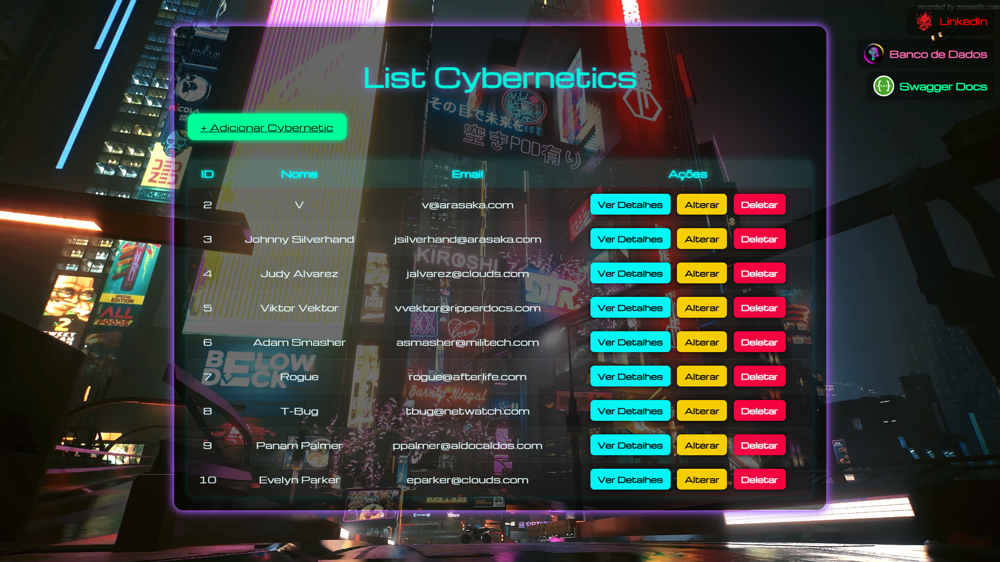

# Cybernetics-api: Sistema de Cadastro de Cybernetics 

Sistema Full Stack com Spring Boot, Thymeleaf e JPA para gerenciamento de cybernetics e suas tarefas.



---

### Tecnologias Utilizadas

* **Back-end:** Java 17, Spring Boot, Spring Data JPA, Hibernate, PostgreSQL, Lombok.
* **Front-end:** Thymeleaf, HTML5, CSS3.
* **Documentação:** Swagger (OpenAPI 3.0).
* **Conteinerização:** Docker, Docker Compose.

---

### Executando com Docker

**Pré-requisitos:**
* Docker
* Docker Compose

#### Método 1: Docker Compose (Recomendado)

Este método sobe a API e o banco de dados com um único comando.

1.  Clone o repositório:
    ```sh
    git clone [https://github.com/PabloRangel1/Cybernetics-api.git](https://github.com/PabloRangel1/Cybernetics-api.git)
    cd Cybernetics-api
    ```

2.  Execute o Docker Compose:
    ```sh
    docker-compose up --build
    ```
    A aplicação estará disponível em `http://localhost:8080`.

#### Método 2: Imagem do Docker Hub (`docker run`)

Este método executa apenas o contêiner da API. Requer uma instância do PostgreSQL rodando separadamente.

```sh
docker run -d --name cybernetics-api \
  -p 8080:8080 \
  -e SPRING_DATASOURCE_URL=jdbc:postgresql://<host_do_banco>:5432/<nome_do_banco> \
  -e SPRING_DATASOURCE_USERNAME=<usuario_do_banco> \
  -e SPRING_DATASOURCE_PASSWORD=<senha_do_banco> \
  pablorangel1/cybernetics-api:1.0
```
*Nota: Substitua os valores `<...>` pelas credenciais do seu banco de dados externo.(TXT Acompanhado com as credenciais)*

#### Acesso à Documentação da API (Swagger)

A documentação interativa da API está disponível no seguinte endereço:
* [http://localhost:8080/swagger-ui.html](http://localhost:8080/swagger-ui.html)

---

### Arquitetura e Funcionalidades

A aplicação utiliza uma arquitetura em camadas (`Controller`, `Service`, `Repository`) e o padrão DTO para transferência de dados.

**Funcionalidades API REST (`/emp`):**
* `POST /emp/criar`: Cadastra um novo colaborador.
* `GET /emp/listar`: Lista todos os colaboradores.
* `GET /emp/listar/{id}`: Busca um colaborador por ID.
* `PUT /emp/alterar/{id}`: Atualiza um colaborador.
* `DELETE /emp/deletar/{id}`: Remove um colaborador.

**Funcionalidades Interface Web (`/emp/ui`):**
* Formulário de cadastro e edição.
* Listagem e visualização detalhada de colaboradores.